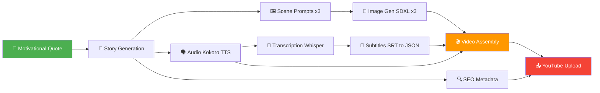
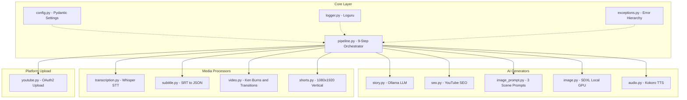

# 🎬 Video Engine

> **AI-powered YouTube video & Shorts generation engine** — from a single motivational quote to a fully-rendered, uploaded YouTube video, powered entirely by local AI models. **No API tokens required.**

[](https://python.org)
[](LICENSE)
[](https://github.com/astral-sh/ruff)

---

## ⭐ Why This Project Exists

Creating YouTube content is time-consuming. You need to write a script, generate visuals, record voiceovers, edit video, add subtitles, optimize SEO, and upload — all before a single viewer sees your work.

**This project automates the entire process.** Give it a motivational quote, and it produces a complete, upload-ready YouTube video with:

- An AI-written story with emotional depth
- Multiple AI-generated scene images with cinematic Ken Burns zoom
- Natural-sounding voiceover with auto-synced subtitles
- Professional intro/outro and crossfade transitions
- SEO-optimized title, description, and hashtags
- Scheduled YouTube upload — all from a single command

**Everything runs locally.** No expensive API keys, no cloud costs, no data leaving your machine. Just your GPU, open-source models, and a quote.

> _Built for creators who want to scale faceless YouTube channels without spending hours in an editor._

---

## ✨ Features

| Feature                    | Description                                                                                                                |
| -------------------------- | -------------------------------------------------------------------------------------------------------------------------- |
| 🤖 **AI Story Generation** | Creates unique motivational stories using local LLM (Ollama/Gemma3) with 320+ randomised style/tone/character combinations |
| 🔍 **SEO Optimisation**    | Auto-generates catchy titles, descriptions, and trending hashtags                                                          |
| 🖼️ **AI Image Generation** | Produces 3 scene images locally using **Stable Diffusion XL** on GPU — no API token needed                                 |
| 🗣️ **Text-to-Speech**      | Natural voice synthesis with Kokoro TTS (chunked for long text)                                                            |
| 📝 **Auto Subtitles**      | Whisper-powered transcription with word-level timing                                                                       |
| 🎞️ **Video Assembly**      | Ken Burns zoom, crossfade transitions, intro/outro cards, bottom-third subtitles                                           |
| 📤 **YouTube Upload**      | OAuth2 resumable uploads with scheduled publishing                                                                         |
| 🐳 **Docker Ready**        | Multi-stage Dockerfile with Ollama integration                                                                             |
| 🏗️ **Clean Architecture**  | 4-layer design with config, logging, and custom exceptions                                                                 |

---

## � Architecture

### Pipeline Flow



### System Architecture



### Module Layout

```
src/video_engine/
├── core/                  ← Configuration, logging, exceptions, orchestrator
│   ├── config.py          Pydantic BaseSettings (.env driven)
│   ├── logger.py          Loguru (console + rotating file)
│   ├── exceptions.py      Stage-specific error hierarchy
│   └── pipeline.py        9-step orchestrator with timing
├── generators/            ← AI content creation
│   ├── story.py           LLM story (Ollama)
│   ├── seo.py             YouTube SEO metadata
│   ├── image_prompt.py    3 visual scene prompts from story
│   ├── image.py           Stable Diffusion XL (local GPU)
│   └── audio.py           Kokoro TTS
├── processors/            ← Media processing
│   ├── transcription.py   Whisper STT → SRT
│   ├── subtitle.py        SRT ↔ JSON
│   ├── video.py           Landscape video (Ken Burns + transitions)
│   └── shorts.py          YouTube Shorts (1080×1920)
└── uploaders/             ← Platform publishing
    └── youtube.py         OAuth2 resumable upload
```

---

## 🚀 Quick Start

### Prerequisites

- **Python 3.10+**
- **FFmpeg** (for MoviePy video rendering)
- **Ollama** running locally with `gemma3:4b` model
- **GPU with ≥6GB VRAM** (recommended for Stable Diffusion image generation)

### 1. Clone & Install

```bash
git clone https://github.com/tamilarasu18/ai-youtube-automation.git
cd ai-youtube-automation

# Create virtual environment
python -m venv venv
venv\Scripts\activate        # Windows
# source venv/bin/activate   # macOS/Linux

# Install dependencies
pip install -r requirements.txt
pip install -e .
```

### 2. Configure

```bash
# Copy the example env file
cp .env.example .env

# Edit .env with your settings
notepad .env                 # Windows
# nano .env                  # macOS/Linux
```

**All settings have sensible defaults** — the only required external service is Ollama running locally.

### 3. Setup Assets

Place these files in the `assets/` directory:

```
assets/
├── fonts/
│   └── Anton-Regular.ttf        # Subtitle font
└── audio/
    └── background_music.mp3     # Background music track
```

### 4. YouTube Setup (Optional)

For YouTube upload functionality:

1. Create a project in [Google Cloud Console](https://console.cloud.google.com)
2. Enable the **YouTube Data API v3**
3. Create OAuth 2.0 credentials (Desktop app)
4. Download the client secrets JSON
5. Place it at `config/client.json`

---

## 📖 Usage

### CLI — Single Video

```bash
video-engine run "Your motivational quote here"

# With scheduled publish
video-engine run "Your quote" --schedule "2025-06-01T15:00:00+05:30"
```

### CLI — Batch Mode

Create a JSON file with prompts:

```json
[
  { "prompt": "First motivational quote", "time": "2025-06-01T15:00:00+05:30" },
  { "prompt": "Second motivational quote", "time": "2025-06-01T17:00:00+05:30" }
]
```

```bash
video-engine batch prompts.json
```

### REST API

```bash
# Start the server
video-engine serve --port 8000

# Generate via API
curl -X POST http://localhost:8000/generate \
  -H "Content-Type: application/json" \
  -d '{"prompt": "Your motivational quote", "time": "2025-06-01T15:00:00+05:30"}'

# Health check
curl http://localhost:8000/health
```

### Docker

```bash
# Build and start all services (Ollama + Engine)
docker-compose up --build

# Or run a single generation
docker-compose run video-engine video-engine run "Your quote"
```

---

## ⚙️ Configuration Reference

All settings are configured via environment variables or `.env` file.

| Variable                 | Default                                    | Description                                    |
| ------------------------ | ------------------------------------------ | ---------------------------------------------- |
| `OLLAMA_URL`             | `http://localhost:11434/api/generate`      | Ollama API endpoint                            |
| `OLLAMA_MODEL`           | `gemma3:4b`                                | LLM model name                                 |
| `SD_MODEL_ID`            | `stabilityai/stable-diffusion-xl-base-1.0` | Stable Diffusion model                         |
| `SD_NUM_STEPS`           | `30`                                       | Inference steps (20–50, higher = better)       |
| `SD_GUIDANCE_SCALE`      | `7.5`                                      | Prompt adherence (5–15)                        |
| `KOKORO_VOICE`           | `af_heart`                                 | Kokoro TTS voice preset                        |
| `WHISPER_MODEL`          | `medium.en`                                | Whisper model size                             |
| `VIDEO_FPS`              | `30`                                       | Output video frame rate                        |
| `VIDEO_BITRATE`          | `20000k`                                   | Video encoding bitrate                         |
| `MAX_SHORTS_DURATION`    | `60`                                       | Max Shorts segment length (seconds)            |
| `FONT_PATH`              | `assets/fonts/Anton-Regular.ttf`           | Subtitle font path                             |
| `YOUTUBE_PRIVACY_STATUS` | `private`                                  | Upload privacy (`private`/`public`/`unlisted`) |
| `LOG_LEVEL`              | `INFO`                                     | Logging level                                  |

See [`.env.example`](.env.example) for the complete list.

---

## 📁 Project Structure

```
generate-video-clean/
├── .env.example            ← Environment template
├── .gitignore              ← Git ignore rules
├── Dockerfile              ← Multi-stage Docker build
├── docker-compose.yml      ← Ollama + Engine orchestration
├── pyproject.toml          ← Project metadata & dependencies
├── requirements.txt        ← Pinned dependencies
├── README.md               ← This file
├── config/                 ← YouTube OAuth credentials (gitignored)
├── assets/                 ← Fonts, audio, images (user-provided)
├── output/                 ← Generated videos (gitignored)
├── logs/                   ← Application logs (gitignored)
└── src/
    └── video_engine/
        ├── __init__.py
        ├── cli.py           ← CLI entry point (run/batch/serve)
        ├── api.py           ← FastAPI REST server
        ├── core/            ← Config, logging, exceptions, pipeline
        ├── generators/      ← AI content creation modules
        ├── processors/      ← Media processing modules
        └── uploaders/       ← Platform publishing modules
```

---

## 🔧 Troubleshooting

<details>
<summary><b>🔴 CUDA out of memory</b></summary>

**Symptoms:** `torch.cuda.OutOfMemoryError` during image generation

**Solutions:**

1. The pipeline clears GPU cache between each image — if it still OOMs, reduce `SD_NUM_STEPS` to `20` in `.env`
2. Portrait images need more VRAM — if they fail, Shorts assembly is automatically skipped (landscape video still works)
3. On T4 GPUs (16GB), all 3 landscape + 3 portrait images should fit. On GPUs with <12GB, set `SD_NUM_STEPS=15`
</details>

<details>
<summary><b>🔴 ImageMagick "unset" / TextClip error</b></summary>

**Symptoms:** `FileNotFoundError: No such file or directory: 'unset'`

**Solutions:**

1. Install ImageMagick: `sudo apt-get install imagemagick`
2. Set the env variable: `export IMAGEMAGICK_BINARY=/usr/bin/convert`
3. Fix the policy file: `sudo sed -i 's/rights="none"/rights="read|write"/g' /etc/ImageMagick-6/policy.xml`
</details>

<details>
<summary><b>🔴 Ollama connection refused</b></summary>

**Symptoms:** `PipelineError: Ollama server not reachable`

**Solutions:**

1. Start Ollama: `ollama serve` (or `nohup ollama serve &` on Colab)
2. Pull the model: `ollama pull gemma3:4b`
3. Verify: `curl http://localhost:11434` → should return "Ollama is running"
</details>

<details>
<summary><b>🟡 "asterisk" appears in subtitles</b></summary>

**Symptoms:** Subtitles show the word "asterisk" literally

**Cause:** The LLM used markdown formatting (`*word*`) which the TTS engine spoke aloud.

**Solution:** Already fixed — `story.py` strips all markdown formatting. Make sure you're on the latest version: `git pull`

</details>

<details>
<summary><b>🟡 Video renders but looks static</b></summary>

**Symptoms:** Single image for the entire video, no scene changes

**Cause:** Either the LLM returned only 1 scene prompt, or image generation partially failed.

**Solutions:**

1. Check `output/video/prompt_1.txt`, `prompt_2.txt`, `prompt_3.txt` exist
2. Check `output/background_file/` for `landscape_1.jpg`, `landscape_2.jpg`, `landscape_3.jpg`
3. If only `landscape.jpg` exists (no number), the old single-image path is used as fallback
</details>

<details>
<summary><b>🟡 YouTube upload fails with "Access blocked"</b></summary>

**Symptoms:** `Error 400: invalid_request` when clicking the OAuth link

**Cause:** Google deprecated the OOB (out-of-band) OAuth flow.

**Solution:** Use the refresh token approach — store `config.json` with your `youtube_client_id`, `youtube_client_secret`, and `youtube_refresh_token` in Google Drive. The notebook's Step 4b builds `token.json` automatically.

</details>

<details>
<summary><b>🟢 ModuleNotFoundError: No module named 'video_engine'</b></summary>

**Symptoms:** Import error when running the pipeline

**Solutions:**

1. The package uses a `src` layout — install with: `pip install -e .`
2. On Colab, ensure `sys.path` includes the `src/` directory
3. Run `pip install -e .` inside the cloned repo directory
</details>

<details>
<summary><b>🟢 Slow video rendering (30+ minutes)</b></summary>

**Symptoms:** Video rendering takes very long on Colab

**Cause:** Ken Burns effect needs to resize every frame.

**Solutions:**

1. Ensure `opencv-python-headless` is installed (`cv2` is 10x faster than PIL fallback)
2. Reduce `VIDEO_FPS` to `24` in `.env`
3. Use `VIDEO_PRESET=ultrafast` for testing (switch to `slow` for production)
</details>

---

## 🔧 Development

```bash
# Install dev dependencies
pip install -e ".[dev]"

# Lint
ruff check src/

# Type check
mypy src/

# Run tests
pytest
```

---

## 🤝 Contributing

1. Fork the repository
2. Create a feature branch (`git checkout -b feature/amazing-feature`)
3. Commit your changes (`git commit -m 'Add amazing feature'`)
4. Push to the branch (`git push origin feature/amazing-feature`)
5. Open a Pull Request

---

## 📄 License

This project is licensed under the MIT License — see the [LICENSE](LICENSE) file for details.

---

## 🙏 Acknowledgements

- [Ollama](https://ollama.ai) — Local LLM inference
- [Kokoro](https://github.com/hexgrad/kokoro) — Text-to-speech
- [OpenAI Whisper](https://github.com/openai/whisper) — Speech recognition
- [Stable Diffusion XL](https://huggingface.co/stabilityai/stable-diffusion-xl-base-1.0) — Local image generation
- [Diffusers](https://huggingface.co/docs/diffusers) — Stable Diffusion pipeline
- [MoviePy](https://zulko.github.io/moviepy/) — Video composition
- [FastAPI](https://fastapi.tiangolo.com) — REST API framework
